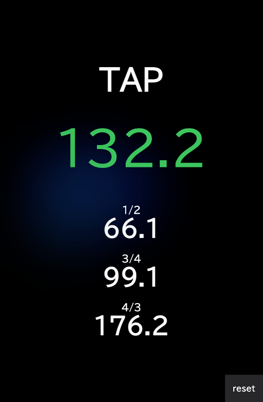

# BPM Calculator for DJ

This application is a tool for DJs and music producers to calculate the tempo of beats (BPM: Beats Per Minute) in real time with **complete offline support** as a Progressive Web App (PWA).

## Features

### 🎵 Core Functionality
- **Real-time BPM calculation** in response to user taps
- **Visual accuracy indicator** - The color of the displayed BPM indicates calculation accuracy (green = highest accuracy)
- **Multiple ratio display** - Shows values of 1/2, 3/4, 4/3 of the calculated BPM for beat matching

### 📱 PWA Support
- **Complete offline functionality** - Works without internet connection
- **App-like experience** - Install on your device like a native app
- **Fast loading** - Optimized caching for instant startup
- **Update notifications** - Automatic updates with user prompts

### 🎛️ DJ-Friendly Design
- **Full-screen tap area** - Maximum usability during live performance
- **Large, clear display** - Easy to read in various lighting conditions
- **Reset functionality** - Quick clear for new measurements

> [!NOTE]
> The calculation uses intelligent logic that ignores obviously short intervals and automatically starts new calculations after extended pauses.

### How to Use

1. Open the application in your browser or install as PWA
2. Tap anywhere on the screen to the beat
3. Watch the BPM calculate in real-time with accuracy indicators
4. Use the ratio values (1/2, 3/4, 4/3) for beat matching
5. Tap "reset" to start fresh measurements



## Tech Stack

- **Frontend**: [Vite](https://vitejs.dev/) + [React](https://react.dev/) + [TypeScript](https://www.typescriptlang.org/)
- **Styling**: [Tailwind CSS](https://tailwindcss.com/)
- **PWA**: [vite-plugin-pwa](https://vite-pwa-org.netlify.app/) with [Workbox](https://workboxjs.org/)
- **Math**: [BigNumber.js](https://mikemcl.github.io/bignumber.js/) for precise calculations
- **Deployment**: [Vercel](https://vercel.com/)

## Development

### Prerequisites
- Node.js 18+ 
- pnpm (recommended) or npm/yarn

### Getting Started

1. **Clone the repository**
   ```bash
   git clone https://github.com/tainakanchu/bpm-calculator-for-dj.git
   cd bpm-calculator-for-dj
   ```

2. **Install dependencies**
   ```bash
   pnpm install
   # or
   npm install
   ```

3. **Start development server**
   ```bash
   pnpm dev
   # or
   npm run dev
   ```

4. **Open your browser**
   Navigate to [http://localhost:5173](http://localhost:5173)

### Scripts

- `pnpm dev` - Start development server with HMR
- `pnpm build` - Build for production
- `pnpm preview` - Preview production build locally
- `pnpm lint` - Run ESLint checks

### PWA Development

The PWA functionality is automatically available in development mode. To test:

1. Open [http://localhost:5173](http://localhost:5173)
2. Open DevTools → Application → Service Workers
3. Check "Offline" to test offline functionality
4. Use "Add to Home Screen" to test installation

## Architecture

### Migration from Next.js
This project was migrated from Next.js to Vite + React for:
- **Better performance** - Faster development and build times
- **Simpler architecture** - Reduced complexity for SPA use case
- **Enhanced PWA support** - Better offline capabilities with vite-plugin-pwa
- **Modern tooling** - Latest Vite ecosystem benefits

### Project Structure
```
src/
├── components/     # React components
├── hooks/         # Custom React hooks
├── types/         # TypeScript type definitions
├── utils/         # Utility functions
├── App.tsx        # Main app component
└── main.tsx       # Application entry point
```

## Contributing

1. Fork the repository
2. Create a feature branch (`git checkout -b feature/amazing-feature`)
3. Commit your changes (`git commit -m 'Add amazing feature'`)
4. Push to the branch (`git push origin feature/amazing-feature`)
5. Open a Pull Request

## License

This project is open source and available under the [MIT License](LICENSE).
